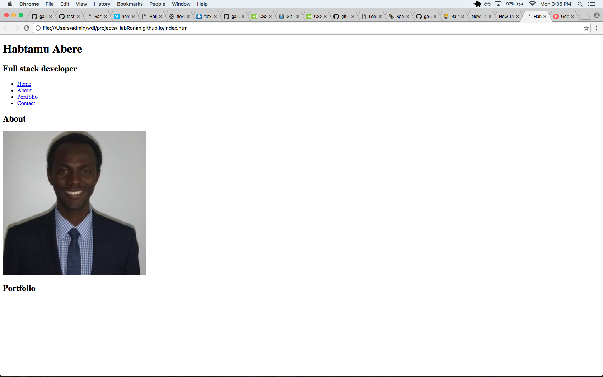
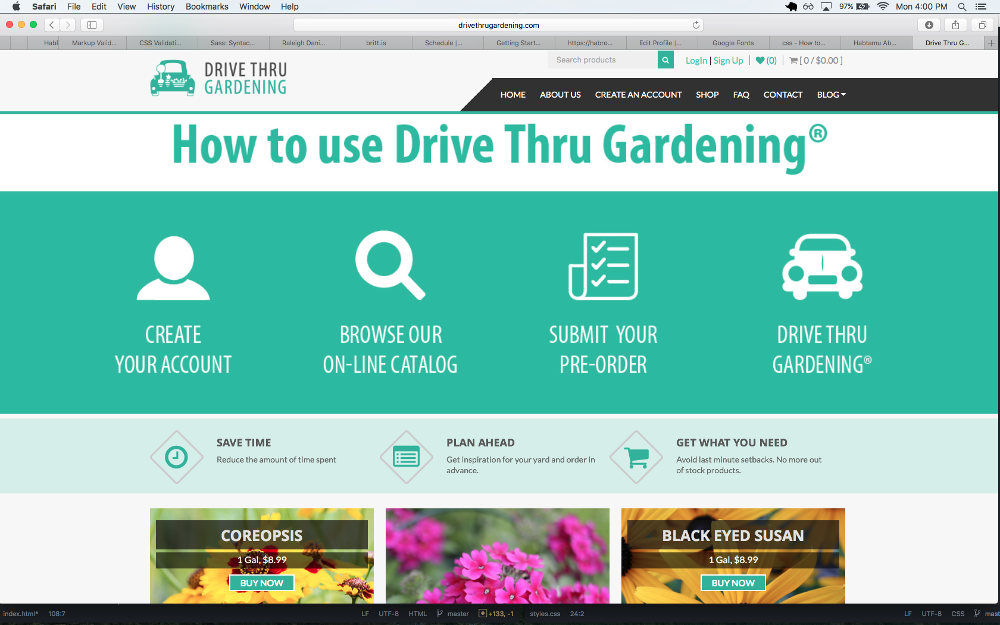

# HabRonan.github.io
Portfolio page

<!-- 

      <nav>

         <ul>

          <li><a href="#">Home</a></li>
          <li><a href="#">About</a></li>
          <li><a href="#">Portfolio</a></li>
          <li><a href="#">Contact</a></li>

         </ul>

      </nav>

  

 </header>

<main>
<h2>About</h2>

    
  

  

    

      <h3>Language</h3>
      <ul>
        <li>Javascript</li>
        <li>HTML5/CSS3</li>
        <li>Node.js</li>
        <li></li>
        <li></li>
        <li></li>
      </ul>
    

    

      <h3>Framework</h3>

    

    

    

  

  

    
    Marine Education and Training Authority,Israel
Master's degree, Marine Science/Merchant Marine Officer
2011
Bahir Dar University, Bahir dar Ethiopia
Bachelor of Science (B.Sc.), Mechanical Engineering
2006 – 2010

</main>

  <h2>Portfolio</h2>

  <h3>Personal site</h3>

   

   <h3>Nursery Project</h3>
   

-->
